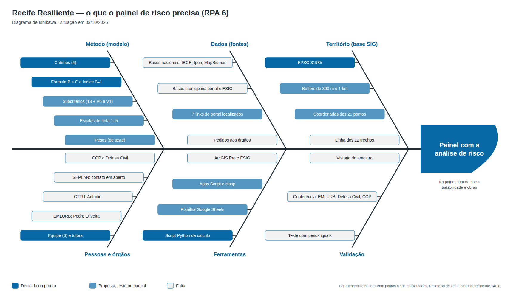

# 4. Cronograma

| Etapa | Prazo | Entregas da equipe (proposta) |
|---|---|---|
| Etapa 2 — Escolher | **14/10/2026** | Recorte fechado; critérios e pesos aprovados pelo grupo; coordenadas dos 21 pontos conferidas |
| Etapa 3 | **27/10/2026** | Dados de SIG coletados (buffers de 300 m); notas preenchidas; primeiro ranking e matriz |
| Etapa 4 | **04/11/2026** | Teste do protótipo: validação do ranking com EMLURB, Defesa Civil e COP; vistorias de campo de uma amostra |
| Etapa 5 — Final | **11/11/2026** | Apresentação (até 8 slides), resumo executivo de 1 página, protótipo/teste e plano de 90 dias |

> ⚠️ Só as datas foram passadas pelo programa. As entregas de cada etapa são
> uma proposta de distribuição do trabalho e precisam ser confirmadas com a
> equipe e com a tutora.

## Caminho crítico até 14/10
1. Transcrever os 24 subcritérios da planilha para `dados/modelos/criterios.csv`.
2. Fechar os pesos com o grupo.
3. Conferir as coordenadas dos 21 pontos.
4. Definir o índice de vulnerabilidade social (IVS/Ipea ou outro).

## O que o painel precisa (Ishikawa)

Situação em 03/10/2026. Gerado por `scripts/gerar_ishikawa.py`: mude a
situação do item no script e rode de novo (o PNG é exportado do SVG).
