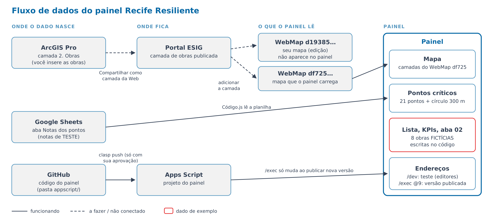

# 8. Painel

## Base (decidido por Pedro em 02/10/2026)
O painel em Google Apps Script já existente é a base. Muita coisa vai mudar.

- Código: pasta `appscript/` (cópia baixada com `clasp`, projeto
  `1Om9PIGQQrIXZ9cTFqbv_iLv9DIvyGW3AbJEDejtEU2SC9PbKDbUVuIFr`).
- Web app (`doGet`) com ArcGIS Maps SDK 4.29, que carrega um WebMap do portal
  ESIG (`esigportal2.recife.pe.gov.br`). Desde 05/10/2026, item `d19385d68f1b4303b5f94ddc5ce58ff6`
  ("Recife Resiliente v2", publicado por Pedro; antes `df725ec964b840a1afbc348ae4555c20`).
- Abas atuais: 01 Panorama · 02 Físico-Financeiro · 03 Ficha do Ponto.
- Os dados atuais são ilustrativos (8 obras fictícias), escritos no código.

## Fluxo de dados

Gerado por `scripts/gerar_fluxo_painel.py` (06/10/2026). Tracejado = a fazer ou
não conectado.

## Decisões
| Tema | Decisão |
|---|---|
| Obras fictícias | Substituídas em 05/10/2026 pelas obras reais da camada de obras do WebMap |
| Notas pelo Google Sheets | Ainda não |
| Acesso ao painel | A definir |
| Pontos críticos | Pedro vai subir um mapa novo no ArcGIS com os pontos |
| Pontos críticos no painel | Teste: o painel lê a aba "Notas dos pontos" da planilha Google Sheets `1DN3abWIPk0dvOkh-28D2NGYBLgMI437Vx7Sk7TqpDc0` e mostra os pontos com popup |
| Rede hidrográfica | Removida do código (`HidroData.html`); virá das camadas do ArcGIS |

## Implantações
- **Teste (HEAD, sempre o código mais recente):**
  https://script.google.com/macros/s/AKfycbwHvKBxXuhdg200oKKwCvdF4uZPHBWsiEE9kTqK5TI/dev
  (só abre para quem é editor do projeto).
- Versões publicadas: 9 implantações; a mais recente é a @9 "Primeira versão
  que deu certo". O `clasp push` não altera nenhuma delas.
- 02/10/2026: primeiro `clasp push` (pontos críticos lidos da planilha,
  sem HidroData).
- 03/10/2026: `clasp push` com as variáveis de 03/10 (nomes novos; I3, V5
  e V6) e a função única `atualizarSubcriterios0310`, executada por Pedro no
  editor. Aba "Notas dos pontos" conferida: 7 cabeçalhos renomeados, V5 e V6
  antes do V1, I3 antes do I2 (ordem I1, I3, I2), colunas novas sem nota e
  sem peso, "Notas preenchidas" = 15 nos 21 pontos, risco calculado nos 21.
  Fórmulas escritas por script não usam separador de argumentos (planilha em
  pt-BR usa `;`).
- 03/10/2026: o cartão do ponto passa a mostrar o nome de cada variável
  como está no cabeçalho da planilha. Para renomear, basta mudar o texto
  depois do código (ex.: `V5` + quebra de linha + novo nome); **não mudar o
  código**. A função `atualizarSubcriterios0310` foi removida.
- 03/10/2026: `clasp push` com o branch do painel (gota com onda, círculo
  de 300 m) juntado ao das variáveis. O push anterior do mesmo dia tinha
  ido sem esses commits.
- 03/10/2026: painel conferido por Pedro (gota, círculo de 300 m, nomes no
  cartão). Novo `clasp push` com os termos novos: o cartão mostra
  "Dimensão / variável". Na planilha, a aba "Checklist subcritérios" passou
  a se chamar "Checklist variáveis" (o painel não lê essa aba).
- 03/10/2026: planilha renomeada para "Recife_Resiliente_Checklist_Variaveis"
  (o link não muda). Abas "Checklist variáveis" e "Glossário" reescritas com o
  conteúdo do `.xlsx` atual (18 variáveis, termos novos); as fórmulas do
  resumo foram mantidas e se ajustaram às linhas novas (N5:N22).
- 03/10/2026: coluna "Fonte de medição" (E) criada na aba "Checklist
  variáveis", ao lado de "Como medir", vazia (a preencher). As colunas a
  preencher passaram a ser O, P e Q; fórmulas e listas se ajustaram.

- 05/10/2026 (`clasp push` feito com aprovação de Pedro): WebMap trocado para "Recife Resiliente v2";
  a lista "Legenda e Camadas" mostra os grupos do WebMap (▸ abre as camadas de dentro)
  e segue a ordem do Conteúdo do ArcGIS (camada de cima primeiro).

- 05/10/2026: restauradas 346 regras de estilo (lista de camadas, mapa base, controles do mapa, aviso do
  Google Maps, abas 02 e 03) que tinham sido apagadas por engano no commit 2982a35 (02/10). Ficam antes
  das regras atuais, que prevalecem em caso de conflito.

- 05/10/2026: nova legenda "Camadas": amostra do símbolo real de cada camada (inclui hachuras do
  ArcGIS Pro), classes de cada camada (ex.: tipos de via), olho para mostrar/ocultar, grupos recolhíveis,
  nomes sem a numeração do Conteúdo e painel que recolhe no título.

- 05/10/2026: lista, KPIs, filtros e ficha passam a usar as **obras reais** da camada de obras do
  WebMap (camada cujo nome contém "obra"; campos obra, nome, bairro, bacia, status, invest, orgao, fonte;
  polígonos com o mesmo número viram uma obra só). Andamento, prazos, empresa e entraves não existem na
  base: aparecem como "a informar"; a aba 02 mostra aviso de "sem dados de acompanhamento" e a ficha
  (aba 03) mostra só os dados da camada. KPI "Pontos mitigados" virou "Obras concluídas".

- 05/10/2026: `clasp push` das obras reais. Criada a aba **"Obras"** na planilha do painel (25 colunas:
  identificação, situação, valores, prazos, % físico, escopo, entraves, fonte_info), com a obra 1
  (Canal do Sanbra) preenchida a partir da camada e a obra 2 em branco. O painel **ainda não lê** essa aba
  (próximo passo: ligar pela `obra_id`, com a planilha mandando nos dados e o mapa só no desenho).
- 05/10/2026: criada a aba **"Cronograma das obras"** (uma linha por macroetapa: obra_id, ordem,
  macroetapa, início e término previstos e reais, % concluído, caminho crítico, responsável,
  observações), com 11 linhas para cada obra (1 e 2). Nome da macroetapa, datas e % em branco, para
  preenchimento livre (decisão de Pedro, 05/10). Vai alimentar o Gantt da ficha (aba 03).

- 05/10/2026 (código; push após aprovação): o painel lê as abas "Obras" e "Cronograma das obras"
  (`getObras()` em `Código.js`) e junta com o desenho da camada de obras pelo `obra_id`. A planilha
  manda nos dados; obra só na planilha aparece como "sem desenho no mapa". A ficha (aba 03) mostra todos
  os campos da aba "Obras" e o Gantt das macroetapas (previsto, realizado, atrasado, caminho crítico).
  A aba 02 continua com o aviso até ser adaptada aos dados reais.

- 05/10/2026: lista de intervenções mostra **só as obras da aba "Obras"** (decisão de Pedro). Polígono
  do mapa sem linha na planilha fica de fora; se a planilha não puder ser lida, a lista avisa.

- 07/10/2026 (`clasp push` com aprovação de Pedro): **lista de cartões dos pontos críticos à
  direita do mapa**, no estilo da lista de intervenções: ordem do ranking, posição, índice de risco
  (cor na borda), trecho, bairro · tipo e aviso "Local aproximado". Clicar no cartão aproxima o mapa
  e abre o cartão do ponto; clicar no ponto do mapa marca o cartão na lista. A busca do topo também
  filtra a lista (trecho ou bairro). Botões de zoom e legenda passaram para a esquerda da lista.

- 07/10/2026 (`clasp push` com aprovação de Pedro): **pontos das obras com ícone por tipo**. O painel lê a
  coluna "coordenadas (lat, lon)" da aba "Obras" e desenha cada obra na camada "Obras (pontos da
  planilha)", com o ícone do tipo (canal, dragagem, reservatório, dique, parque alagável, rede;
  vazado quando em licitação; cone genérico quando o tipo está vazio). Coordenada vazia, ilegível ou
  fora do Recife não desenha ponto. Clicar no ponto seleciona a obra na lista; os filtros e a busca
  valem também para os pontos. A coordenada passa a ser o centro do zoom ao selecionar a obra.
  Ícones embutidos no código com `python3 scripts/gerar_icones_obras_tipo.py --js`.

## Estado em 02/10/2026 (aprovado por Pedro)
- Paleta: #0869A6 · #2685BF · #5496BF · #FFFFFF · #F2F2F2 (painel inteiro).
- Pontos críticos lidos da planilha Google Sheets, cor pelo índice de risco.
- Cartão do ponto (no lugar do popup do ArcGIS): abre à direita do ponto,
  centralizado na altura dele, a 36 px; estilo da ficha do Plano de Ações
  de SP; sem número do ponto; nível de risco em palavras; tabela dimensão/
  variável × avaliação; botões Aproximar e Street View.

## Em aberto
- Cores do nível de risco: manter verde/amarelo/laranja/vermelho ou usar
  tons de azul.
- Liberar `*.arcgis.com` e `esigportal2.recife.pe.gov.br` na rede do
  ambiente para testar o painel antes de cada envio.

## Como trabalhar no código
1. Editar os arquivos em `appscript/`; cada mudança vira um commit.
2. Enviar ao Apps Script com `clasp push` **só depois da aprovação de Pedro**.
3. Testar pela URL de teste (Implantar → Testar implantações); o link
   publicado só muda quando Pedro publicar uma nova versão.

## Camadas para o ArcGIS (`dados/processados/arcgis/`)
- Pontos: usar `dados/processados/pontos_rpa6.geojson` / `.csv` (os 21 pontos,
  com lat/lon e UTM). A cópia `pontos_criticos_rpa6` foi removida em 04/10/2026.
- `buffer_300m_rpa6.geojson` e `buffer_1000m_rpa6.geojson`: círculos.
- Coordenadas ainda aproximadas.

## Pontos de atenção do painel atual
- A "Matriz de risco" da aba 02 é atraso × severidade das obras, não
  Probabilidade × Consequência. Renomear ou separar quando o risco entrar.
- `access: ANYONE`: se o WebMap do ESIG exigir login, quem não tiver acesso
  pode ver o mapa vazio (não testado).
- `GOOGLE_MAPS_EMBED_KEY` vazio: Street View e modo Google Maps mostram aviso.
