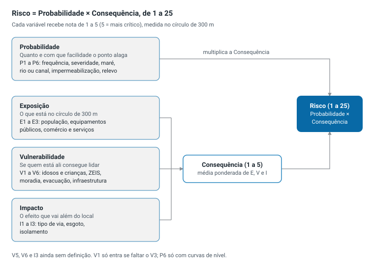

# 10. Dimensões e variáveis de risco de alagamento

> **Documento-chave** das dimensões e variáveis (decisão de Pedro,
> 03/10/2026). O que for decidido é registrado aqui. O
> [Google Docs da equipe](https://docs.google.com/document/d/12zj_bPx0u5ejNpUsbFNEPsy7WGpTRwuH6k23O0k8f2I/edit)
> é uma cópia para leitura e comentários, atualizada a partir deste arquivo.
> Lista adotada em 03/10/2026, ainda não validada pelo grupo.

O risco de cada um dos 21 pontos críticos da RPA 6 é medido por 4 dimensões
e 19 variáveis. Este documento explica o que cada uma significa e por que
importa.

## Como o risco é calculado

A Probabilidade multiplica a Consequência. Por isso um ponto que quase não
alaga fica com risco baixo, mesmo com muita gente por perto. Os pesos de cada
dimensão e variável ainda serão definidos pelo grupo (pendência 1).

## Probabilidade

**Pergunta:** quanto e com que facilidade o ponto alaga? É a dimensão que
multiplica a Consequência. Sem nota de Probabilidade, o ponto não entra no
ranking.

### P1 — Frequência e recorrência histórica
- **O que é:** quantas vezes o ponto alaga.
- **Por que importa:** é a prova mais direta de que o problema se repete.
- **Como medimos:** média de eventos por ano nas 3 últimas estações chuvosas.
  Nota 1 para menos de 1 evento por ano, nota 5 para 7 ou mais.
- **De onde vem o dado:** ficha preenchida com a EMLURB; confirmação com as
  ocorrências do COP e da Defesa Civil.

### P2 — Severidade
- **O que é:** quão grave é cada alagamento.
- **Por que importa:** dez centímetros de água por meia hora não são o mesmo
  que um metro por um dia inteiro.
- **Como medimos:** altura máxima da água e tempo para baixar. Nota 1 abaixo
  de 10 cm ou menos de 1 hora; nota 5 acima de 1 m ou mais de 12 horas.
- **De onde vem o dado:** ficha da EMLURB; escuta com Defesa Civil e moradores.

### P3 — Influência da maré
- **O que é:** se a água da chuva deixa de escoar quando a maré sobe.
- **Por que importa:** no Recife, muitos canais desaguam no mar ou em rios
  com maré; com maré alta, a drenagem trava.
- **Como medimos:** classe. Nota 1 quando a maré não influencia, 3 quando
  agrava às vezes, 5 quando o ponto alaga conforme a maré.
- **De onde vem o dado:** ficha da EMLURB; APAC e tábua de marés.

### P4 — Proximidade de rio ou canal
- **O que é:** distância do ponto ao curso d'água mais próximo.
- **Por que importa:** perto de rio ou canal, a água transborda primeiro.
- **Como medimos:** os pontos são ordenados pela distância e divididos em 5
  grupos; os mais próximos recebem nota 5.
- **De onde vem o dado:** bases de drenagem e recursos hídricos do ESIG.

### P5 — Impermeabilização
- **O que é:** quanto do solo em volta está coberto por asfalto e construção.
- **Por que importa:** solo coberto não absorve a chuva, e toda a água vai
  para a rua e para a drenagem.
- **Como medimos:** % do círculo de 300 m com vegetação ou solo permeável.
  Nota 1 acima de 40%, nota 5 abaixo de 10%.
- **De onde vem o dado:** MapBiomas (imagem de satélite) ou edificações do ESIG.

### P6 — Relevo (baixio)
- **O que é:** se o ponto fica mais baixo que o terreno em volta.
- **Por que importa:** a água corre para o ponto mais baixo e se acumula ali.
- **Como medimos:** diferença entre a altura do ponto e a altura média do
  círculo; os pontos mais baixos recebem nota 5.
- **De onde vem o dado:** curvas de nível da Condepe/Fidem. Só entra no
  cálculo se esse dado servir.

## Exposição

**Pergunta:** quem e o que está no caminho da água? Conta o que existe dentro
do círculo de 300 m em volta do ponto. O que é contado aqui não é contado de
novo no Impacto.

### E1 — População
- **O que é:** quantas pessoas moram perto do ponto.
- **Por que importa:** quanto mais moradores, mais gente afetada por cada
  alagamento.
- **Como medimos:** moradores no círculo de 300 m; os pontos com mais
  moradores recebem nota 5.
- **De onde vem o dado:** IBGE, Grade Estatística do Censo 2022 (quadrados de
  200 × 200 m com a população).

### E2 — Equipamentos públicos
- **O que é:** escolas, creches e unidades de saúde perto do ponto.
- **Por que importa:** quando esses serviços são atingidos, muita gente fica
  sem atendimento, e crianças e doentes são os mais expostos.
- **Como medimos:** número de equipamentos no círculo. Nota 1 sem nenhum;
  nota 5 com 5 ou mais, ou com hospital ou UPA.
- **De onde vem o dado:** portal de dados abertos da Prefeitura (escolas, UBS,
  hospitais); IBGE (CNEFE 2022); CNES/DATASUS.

### E3 — Comércio e serviços
- **O que é:** lojas e serviços perto do ponto.
- **Por que importa:** alagamento fecha negócios, estraga mercadoria e afeta
  quem trabalha ali.
- **Como medimos:** número de comércios e serviços no círculo; os pontos com
  mais recebem nota 5.
- **De onde vem o dado:** IBGE (CNEFE 2022) e cadastro do IPTU.

## Vulnerabilidade

**Pergunta:** quem está ali consegue lidar com o alagamento? Duas comunidades
com o mesmo número de moradores sofrem de forma diferente se uma tem casas
térreas em área precária e a outra, prédios com infraestrutura.

### V2 — População vulnerável
- **O que é:** idosos (60 anos ou mais) e crianças pequenas (0 a 4 anos).
- **Por que importa:** têm mais dificuldade de sair de casa, se proteger e se
  recuperar.
- **Como medimos:** % de moradores nessas idades no círculo; os pontos com
  maior % recebem nota 5.
- **De onde vem o dado:** IBGE, Censo 2022 por setor censitário.

### V3 — ZEIS, favelas e comunidades
- **O que é:** assentamentos de baixa renda em volta do ponto.
- **Por que importa:** costumam ter drenagem precária, casas mais frágeis e
  menos recursos para se recuperar.
- **Como medimos:** % da área do círculo em favelas e comunidades ou em
  ZEIS 1. Nota 1 com 0%, nota 5 acima de 50%.
- **De onde vem o dado:** IBGE (Favelas e Comunidades Urbanas 2022) e ZEIS do
  Plano Diretor do Recife.

### V4 — Tipo de moradia
- **O que é:** proporção de casas, em vez de apartamentos.
- **Por que importa:** casa térrea é invadida pela água; apartamento acima do
  térreo, não.
- **Como medimos:** % de domicílios do tipo casa no círculo; os pontos com
  maior % recebem nota 5.
- **De onde vem o dado:** IBGE, Censo 2022 por setor censitário.

### V5 — Dificuldade de evacuação
- **O que é:** ainda sem definição. A ideia veio do documento da equipe.
- **Pergunta em aberto:** é sobre vias estreitas, distância de abrigo ou outra
  coisa? Enquanto não for definida, não entra no cálculo (pendência 15).

### V6 — Infraestrutura precária
- **O que é:** ainda sem definição. A ideia veio do documento da equipe.
- **Pergunta em aberto:** pode reunir o tipo de moradia (V4) e a falta de
  esgoto (I2). Enquanto não for definida, não entra no cálculo (pendência 15).

### V1 — Vulnerabilidade social (IVS)
- **O que é:** índice do Ipea que resume renda, escolaridade, trabalho e
  infraestrutura de cada área.
- **Por que importa:** é uma medida já pronta e conhecida de vulnerabilidade
  social.
- **Como medimos:** maior IVS entre as áreas que tocam o círculo. Nota 1 para
  IVS muito baixo, nota 5 para muito alto.
- **De onde vem o dado:** Ipea, Atlas da Vulnerabilidade Social. É o plano B:
  só entra se o V3 não tiver dado, porque usa o Censo de 2010.

## Impacto

**Pergunta:** que efeito o alagamento tem além do local? Mede o que para de
funcionar na cidade quando o ponto alaga, mesmo para quem não mora perto.

### I1 — Tipo de via
- **O que é:** a importância da via que fica interrompida.
- **Por que importa:** alagar um corredor de ônibus para milhares de pessoas;
  alagar uma via local afeta poucas.
- **Como medimos** (decisão de Pedro, 03/10/2026: seguir estritamente a
  hierarquia viária da CTTU):
  1. **Identificar a via afetada.** Trecho (Linha ou Vários): a própria via
     do trecho. Ponto num cruzamento: todas as vias que se cruzam ali; vale a
     mais importante. Ponto isolado numa via: a própria via.
  2. **Classificar a via pela hierarquia viária da CTTU**
     ([sistema viário](https://cttu.recife.pe.gov.br/sistema-viario) e
     [classificação hierárquica](https://cttu.recife.pe.gov.br/classificacao-hierarquica)):
     corredor de transporte metropolitano, corredor de transporte urbano
     principal, corredor de transporte urbano secundário ou via fora dos
     corredores. O nome da via (avenida ou rua) não conta.
  3. **Converter a classe em nota** pela escala abaixo.
  - Se a classe muda ao longo da via, vale a classe no trecho do ponto. Se o
    ponto pega mais de uma via, vale a de nota mais alta. Interdição
    registrada pela CTTU só confere a nota, não soma.
- **Escala** (decidida por Pedro em 03/10/2026):
  1. Ruas
  2. Demais avenidas
  3. Corredor de transporte urbano secundário
  4. Corredor de transporte urbano principal
  5. Corredor de transporte metropolitano

  Em discussão: trocar as notas 1 e 2 por "vias locais" e "demais vias
  arteriais e coletoras", para seguir a hierarquia também fora dos corredores.
- **De onde vem o dado:** hierarquia viária da CTTU (o site está bloqueado no
  ambiente; lista ainda não obtida). Pendência 17.

### I2 — Risco sanitário
- **O que é:** a chance de a água do alagamento se misturar com esgoto.
- **Por que importa:** água com esgoto espalha doenças, como a leptospirose.
- **Como medimos:** % de domicílios sem ligação à rede de esgoto no círculo;
  os pontos com maior % recebem nota 5.
- **De onde vem o dado:** IBGE, Censo 2022 por setor censitário; Compesa.

### I3 — Isolamento
- **O que é:** ainda sem definição. A ideia veio do documento da equipe.
- **Leitura provável:** a comunidade fica sem saída ou sem acesso a serviços
  quando o ponto alaga.
- **Pergunta em aberto:** confirmar o sentido com a equipe. Enquanto não for
  definido, não entra no cálculo (pendência 15).

### I4 — Proximidade a infraestrutura crítica (proposta, 03/10/2026)
- **O que é:** a distância do ponto até a infraestrutura crítica mais
  próxima.
- **Infraestrutura crítica** (definição do projeto): estrutura cuja
  interrupção por alagamento deixa sem um serviço essencial uma área maior que
  o entorno do ponto. Lista definida por Pedro: estação de metrô, delegacia,
  Corpo de Bombeiros, base do SAMU, aeroporto, subestação da Neoenergia.
  Hospital e UPA ficam no E2, para não contar duas vezes. Em aberto: terminais
  integrados de ônibus, estruturas da Compesa, Defesa Civil e abrigos.
- **Por que importa:** quando uma dessas estruturas é atingida, ou fica
  difícil de alcançar, a região inteira perde o serviço.
- **Como medimos:** distância em linha reta (EPSG:31985) do ponto, ou da
  linha do trecho, até a estrutura mais próxima. Escala decidida por Pedro:
  1. acima de 2.000 m
  2. de 1.500 m a 2.000 m
  3. de 1.000 m a 1.500 m
  4. de 500 m a 1.000 m
  5. até 500 m
- **De onde vem o dado:** CBTU, Polícia Civil, Corpo de Bombeiros, SAMU,
  aeroporto e Neoenergia. Camada ainda não montada.
- **Cuidado:** se quase todos os pontos ficarem acima de 2 km, a variável não
  diferencia os pontos e vira contexto no painel.

## O que fica fora da nota

Estes temas aparecem no painel, mas não mudam o risco do ponto.

| Tema | Onde aparece | Por que fica fora |
|---|---|---|
| Intensidade das chuvas | Contexto no painel | Varia pouco entre 21 pontos da mesma região |
| Tratabilidade | Matriz risco × tratabilidade | Mede se é fácil agir, não o tamanho do risco |
| Causa do alagamento | Ficha do ponto | Explica por que alaga e qual órgão deve agir |
| Obras | Camada do painel | O risco mede a situação de hoje |
| Repercussão e pressão política | Contexto no painel | Não é parte do risco |
